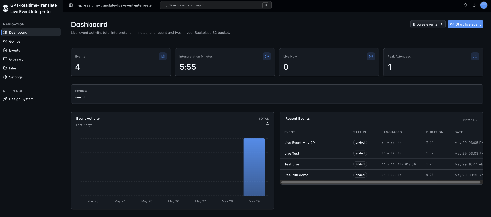
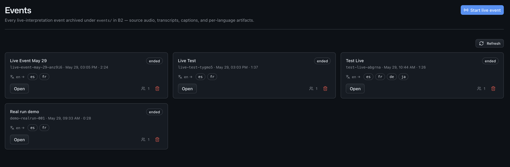
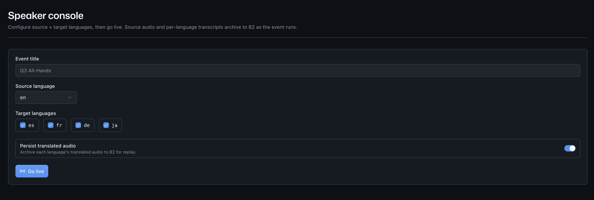
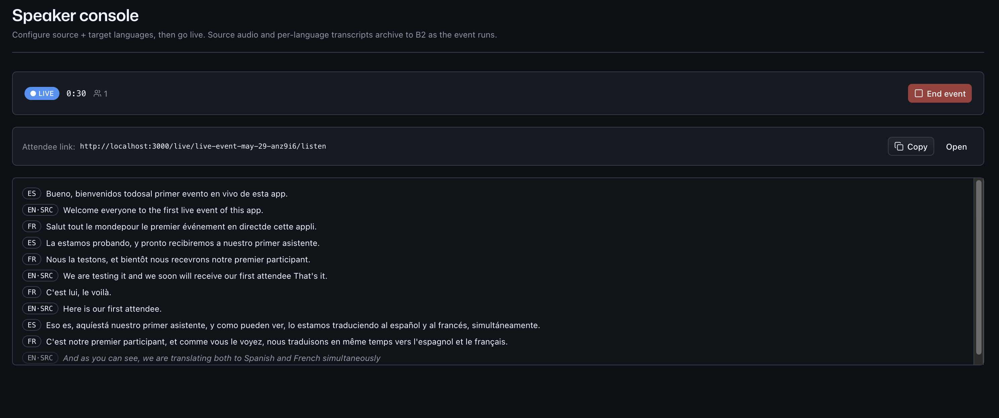
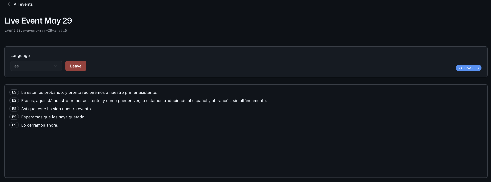

<!-- last_verified: 2026-05-28 -->
# GPT-Realtime-Translate Live Event Interpreter

A real-time **live event interpreter** built on OpenAI's GPT-Realtime-Translate and Backblaze B2. A speaker talks into the browser; attendees pick a target language and receive translated audio plus captions streamed back to them with low latency. Every event archives to B2 as a rich multi-artifact bundle: source audio, source transcript, per-language captions (VTT/SRT), per-language translated transcripts, and (optionally) the translated audio itself.

This is the canonical "fan-out, archive everything" pattern: one source generates many derived artifacts, and object storage is the natural home for the result.

**Live translation is implemented end to end.** With an `OPENAI_API_KEY` set, the speaker console captures the mic and the API bridges to one `gpt-realtime-translate` session per target language, streaming translated audio + captions to attendees; the event archives to B2 (source audio, per-language transcripts/captions) when it ends. Without a key the speaker socket closes with a structured `4001` frame and the rest of the app (events explorer, archive view, glossary, dashboard, full-bucket explorer) still works. A live run requires a real OpenAI key and network access.

## What you get out of the box

- `/live` — speaker console: mic capture, go-live, live caption preview, attendee count, shareable listen link
- `/live/[id]/listen` — attendee listen view: language picker, translated audio playback + live captions
- `/events` — Events explorer grid scoped to the `events/` prefix in B2
- `/events/[id]` — single-event detail view: source-audio playback, per-language transcript / VTT / SRT downloads, artifact listing
- `/glossary` — Glossary management surface (reusable JSON glossaries attachable to events)
- `/files` — full B2 bucket explorer (tree view, preview, download, delete) — non-negotiable keep
- `/` (Dashboard) — total events, total interpretation minutes, live-now count, peak concurrent attendees
- `/design` — design-system showcase including the `EventCard` primitive
- FastAPI backend with strict layered architecture (`types -> config -> repo -> service -> runtime`) and structural tests, including new `test_openai_only_in_repo`

## What it looks like

**Dashboard** — events count, total interpretation minutes, live-now, peak attendees, daily activity:



**Events** — every event archived to B2 with status, language chips, attendee peak, and actions:



**Speaker console** — set the event title, source and target languages, and the persist-audio toggle, then go live:



**Speaker console (live)** — running event with a live caption preview, attendee count, and shareable listen link:



**Attendee listen view** — pick a target language and follow translated captions in real time:



## Agent-First Architecture

This repo is optimized for coding agents. Use the template, point your agent at it, and start building.

The structure follows the principle that **repository knowledge is the system of record**. Anything an agent can't access in-context doesn't exist — so everything it needs to reason about the codebase is versioned, co-located, and discoverable from the repo itself.

### How it works

**[AGENTS.md](AGENTS.md) is the single source of truth for all coding agents.** A ~100-line entry point gives agents the repository layout, architectural invariants, commands, conventions, and pointers to deeper docs.

**Architecture is enforced mechanically, not by convention.** Layering rules, import boundaries, file size limits, and SDK containment (boto3 *and* openai) are verified by structural tests and lints that run on every change.

```
AGENTS.md              Single source of truth — layout, invariants, commands, conventions
ARCHITECTURE.md        System layout, layering rules, data flows
docs/
  features/            Feature docs (events, live-interpretation, transcripts, glossary, dashboard, file-browser)
  app-workflows.md     Speaker, attendee, organizer journeys
  dev-workflows.md     Engineering workflows and testing
  SECURITY.md          Security principles
  RELIABILITY.md       Reliability expectations
  exec-plans/          Execution plans and tech debt tracker
```

### Key design decisions

| Principle | Implementation |
|-----------|---------------|
| Give agents a single source of truth | AGENTS.md ~100 lines — layout, invariants, commands, conventions |
| Enforce invariants mechanically | Structural tests + ruff + ESLint verify boundaries |
| DRY documentation | Each fact lives in one place |
| Strict layered architecture | `types -> config -> repo -> service -> runtime`, enforced by tests |
| Contain external SDKs | `boto3` only in `repo/`; `openai` only in `repo/openai_realtime.py` |
| Prefer boring libraries | stdlib `wave` + `mutagen` for audio metadata, no ffmpeg |
| Keep files agent-sized | 300-line limit per file, enforced by test |
| Docs updated with code | Same-PR requirement prevents documentation rot |
| Structured observability | JSON logging, `/metrics` endpoint, event-aware counters |

## Quick Start

You need: Node.js >= 20, pnpm >= 9, Python >= 3.11, a free **[Backblaze B2 account](https://www.backblaze.com/sign-up/ai-cloud-storage?utm_source=github&utm_medium=referral&utm_campaign=ai_artifacts&utm_content=b2ai-gpt-realtime-translate-live-event-interpreter)**, and an **OpenAI API key** (required for live interpretation; not required to browse archived events).

### Start a new project

**Option 1: GitHub Template (recommended)**

Click the green **"Use this template"** button at the top of this repo.

**Option 2: Clone and reinitialize**

```bash
git clone https://github.com/backblaze-b2-samples/gpt-realtime-translate-live-event-interpreter.git my-interpreter-app
cd my-interpreter-app
rm -rf .git
git init
git add .
git commit -m "Initial commit from gpt-realtime-translate-live-event-interpreter"
```

### Setup

**1. Install dependencies**

```bash
pnpm install
```

**2. Set up the backend**

```bash
cd services/api
python -m venv .venv && source .venv/bin/activate
pip install -r requirements.txt
cd ../..
```

**3. Add your credentials**

```bash
cp .env.example .env
```

Open `.env` and fill in:

- **Backblaze B2** — five required keys. From the [Backblaze B2 dashboard](https://secure.backblaze.com/b2_buckets.htm?utm_source=github&utm_medium=referral&utm_campaign=ai_artifacts&utm_content=b2ai-gpt-realtime-translate-live-event-interpreter), create a bucket and an application key:
  - **Bucket Unique Name** -> `B2_BUCKET_NAME`
  - **Endpoint** -> `B2_ENDPOINT`
  - **Region** (path segment of the endpoint, e.g. `us-west-004`) -> `B2_REGION`
  - **keyID** -> `B2_KEY_ID`
  - **applicationKey** -> `B2_APPLICATION_KEY`
- **OpenAI** — required for live interpretation only. Get a key at https://platform.openai.com/api-keys:
  - `OPENAI_API_KEY` -> your key
  - `OPENAI_REALTIME_MODEL` -> defaults to `gpt-realtime-translate`
- **Defaults** — adjust `DEFAULT_SOURCE_LANGUAGE`, `DEFAULT_TARGET_LANGUAGES`, and `PERSIST_TRANSLATED_AUDIO` to taste.

> Walkthroughs: [creating a bucket](https://www.backblaze.com/docs/cloud-storage-create-and-manage-buckets?utm_source=github&utm_medium=referral&utm_campaign=ai_artifacts&utm_content=b2ai-gpt-realtime-translate-live-event-interpreter) and [creating app keys](https://www.backblaze.com/docs/cloud-storage-create-and-manage-app-keys?utm_source=github&utm_medium=referral&utm_campaign=ai_artifacts&utm_content=b2ai-gpt-realtime-translate-live-event-interpreter).

**4. Run it**

```bash
pnpm dev
```

Frontend at `localhost:3000`, API at `localhost:8000`. Open `/events` and you'll see the empty-state until the first event is created.

`pnpm dev` runs `pnpm doctor` first — a preflight check that catches the common setup gotchas (wrong Node/Python version, missing venv, missing or placeholder `.env`, ports already taken) and tells you exactly how to fix each one.

## Core Features

- [Event Archive](docs/features/event-archive.md) — `/events` explorer and `/events/[id]` detail view; B2 storage layout (`events/<id>/...`).
- [Live Interpretation](docs/features/live-interpretation.md) — speaker console, attendee listen view, WebSocket lifecycle, mic permission flow.
- [Realtime Translation](docs/features/realtime-translation.md) — OpenAI Realtime integration, session lifecycle, reconnect strategy, language list.
- [Transcripts & Captions](docs/features/transcripts-and-captions.md) — VTT/SRT generation, chunk persistence cadence, on-disconnect finalization.
- [Glossary](docs/features/glossary.md) — Reusable JSON glossaries; attach-at-create flow; prompt-injection safety.
- [Bucket Explorer](docs/features/file-browser.md) — Full B2 bucket tree view, kept from the underlying starter.
- [Dashboard](docs/features/dashboard.md) — Event-aware stats: events, interpretation minutes, peak attendees.
- [Audio Metadata Extraction](docs/features/audio-metadata.md) — Post-event source-audio metadata via stdlib `wave` + `mutagen`.
- [Source-Audio Playback](docs/features/audio-playback.md) — Presigned-URL flow, inline `<audio controls>`, expiry, content disposition.
- [Design System](docs/design-system.md) — Tokens, primitives, AI elements, the `EventCard` primitive.

Plus the cross-cutting essentials inherited from the underlying starter:

- Inline error handling — fetch failures surface *what's wrong* and offer a Retry
- Single-source config — one `.env` at the repo root powers both API and web app, validated at startup
- Centralized data layer — every fetch goes through TanStack Query hooks in `apps/web/src/lib/queries.ts`
- Structural tests — verify layering rules, import boundaries, `boto3` containment, **`openai` containment**, file size limits
- Structured JSON logging — every request traced with `request_id`, plus `event_id` / `target_lang` where applicable
- `/health` endpoint — B2 connectivity check
- `/metrics` endpoint — Prometheus-format counters (request count, latency, events started/ended, attendees joined, realtime chunks broadcast)

## Tech Stack

- TypeScript, Next.js 16, React 19, Tailwind v4, shadcn/ui, Recharts
- TanStack Query — caching, dedup, retry, stale-while-revalidate for every fetch
- Python 3.11+, FastAPI, boto3, Pydantic v2, `mutagen`
- OpenAI Realtime API (containment-wrapped in `services/api/app/repo/openai_realtime.py`)
- Backblaze B2 (S3-compatible object storage)
- pnpm workspaces (monorepo)

## Commands

| Command | What it does |
|---------|-------------|
| `pnpm dev` | Start frontend + backend |
| `pnpm dev:web` | Frontend only |
| `pnpm dev:api` | Backend only |
| `pnpm build` | Build frontend |
| `pnpm lint` | Lint frontend |
| `pnpm lint:api` | Lint backend (ruff) |
| `pnpm test:api` | Run backend tests |
| `pnpm check:structure` | Verify layering rules and SDK containment (boto3 + openai) |
| `pnpm test:e2e` | Playwright e2e tests (run `pnpm --filter @gpt-realtime-translate-live-event-interpreter/web exec playwright install chromium` once first) |

## Documentation Map

| Doc | Purpose |
|-----|---------|
| [AGENTS.md](AGENTS.md) | Agent table of contents — start here |
| [ARCHITECTURE.md](ARCHITECTURE.md) | System layout, layering, data flows |
| [docs/features/](docs/features/) | Feature docs (event archive, live interpretation, realtime translation, transcripts, glossary, dashboard, file browser, audio metadata, source-audio playback) |
| [docs/design-system.md](docs/design-system.md) | Design tokens, primitives, AI elements, the `EventCard` |
| [docs/app-workflows.md](docs/app-workflows.md) | Speaker, attendee, organizer journeys |
| [docs/dev-workflows.md](docs/dev-workflows.md) | Engineering workflows and testing (incl. WebSocket testing notes) |
| [docs/SECURITY.md](docs/SECURITY.md) | Security principles |
| [docs/RELIABILITY.md](docs/RELIABILITY.md) | Reliability expectations (incl. Realtime resilience) |
| [docs/exec-plans/](docs/exec-plans/) | Execution plans and tech debt tracker |

## Contributing

Start with [AGENTS.md](AGENTS.md). It's the map — everything else is discoverable from there.

## License

MIT License — see [LICENSE](LICENSE) for details.

## Claude Agent B2 Skill

Manage Backblaze B2 from your terminal using natural language (list/search, audits, stale or large file detection, security checks, safe cleanup).

Repo: [https://github.com/backblaze-b2-samples/claude-skill-b2-cloud-storage](https://github.com/backblaze-b2-samples/claude-skill-b2-cloud-storage)
